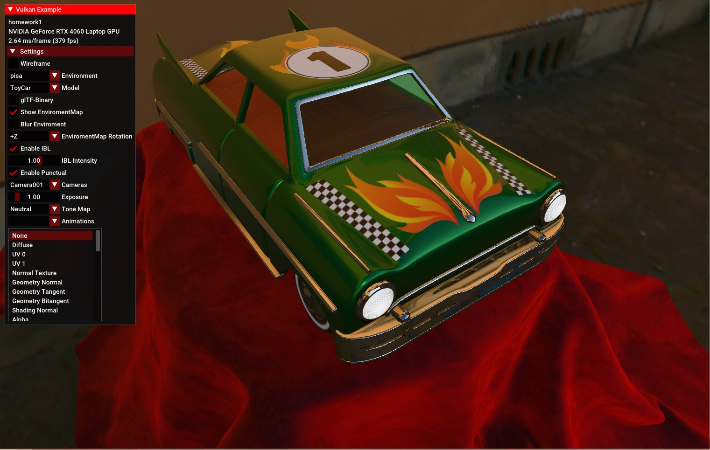

Vulkan glTF Sample Renderer
============================

This is a Vulkan version of glTF Sample Viewer according to https://github.khronos.org/glTF-Sample-Viewer-Release/

Features
--------

- [x] glTF 2.0
- [x] [KHR_animation_pointer](https://github.com/KhronosGroup/glTF/tree/main/extensions/2.0/Khronos/KHR_animation_pointer)
- [x] [KHR_draco_mesh_compression](https://github.com/KhronosGroup/glTF/tree/main/extensions/2.0/Khronos/KHR_draco_mesh_compression)
- [x] [KHR_lights_punctual](https://github.com/KhronosGroup/glTF/tree/main/extensions/2.0/Khronos/KHR_lights_punctual)
- [x] [KHR_materials_clearcoat](https://github.com/KhronosGroup/glTF/tree/main/extensions/2.0/Khronos/KHR_materials_clearcoat)
- [x] [KHR_materials_emissive_strength](https://github.com/KhronosGroup/glTF/tree/KHR_materials_emissive_strength/extensions/2.0/Khronos/KHR_materials_emissive_strength)
- [x] [KHR_materials_pbrSpecularGlossiness](https://github.com/KhronosGroup/glTF/tree/main/extensions/2.0/Khronos/KHR_materials_pbrSpecularGlossiness)
- [x] [KHR_materials_ior](https://github.com/KhronosGroup/glTF/tree/main/extensions/2.0/Khronos/KHR_materials_ior)
- [x] [KHR_materials_sheen](https://github.com/KhronosGroup/glTF/tree/main/extensions/2.0/Khronos/KHR_materials_sheen)
- [x] [KHR_materials_specular](https://github.com/KhronosGroup/glTF/tree/main/extensions/2.0/Khronos/KHR_materials_specular)
- [x] [KHR_materials_transmission](https://github.com/KhronosGroup/glTF/tree/main/extensions/2.0/Khronos/KHR_materials_transmission)
- [x] [KHR_materials_unlit](https://github.com/KhronosGroup/glTF/tree/main/extensions/2.0/Khronos/KHR_materials_unlit)
- [x] [KHR_materials_variants](https://github.com/KhronosGroup/glTF/tree/main/extensions/2.0/Khronos/KHR_materials_variants)
- [x] [KHR_materials_volume](https://github.com/KhronosGroup/glTF/tree/main/extensions/2.0/Khronos/KHR_materials_volume)
- [x] [KHR_materials_iridescence](https://github.com/KhronosGroup/glTF/tree/main/extensions/2.0/Khronos/KHR_materials_iridescence)
- [x] [KHR_materials_anisotropy](https://github.com/KhronosGroup/glTF/tree/main/extensions/2.0/Khronos/KHR_materials_anisotropy)
- [x] [KHR_materials_dispersion](https://github.com/KhronosGroup/glTF/tree/main/extensions/2.0/Khronos/KHR_materials_dispersion)
- [x] [KHR_mesh_quantization](https://github.com/KhronosGroup/glTF/tree/main/extensions/2.0/Khronos/KHR_mesh_quantization)
- [x] [KHR_texture_basisu](https://github.com/KhronosGroup/glTF/tree/main/extensions/2.0/Khronos/KHR_texture_basisu)
- [x] [KHR_texture_transform](https://github.com/KhronosGroup/glTF/tree/main/extensions/2.0/Khronos/KHR_texture_transform)
- [x] [KHR_xmp_json_ld](https://github.com/KhronosGroup/glTF/tree/main/extensions/2.0/Khronos/KHR_xmp_json_ld)
- [x] [EXT_mesh_gpu_instancing](https://github.com/KhronosGroup/glTF/tree/main/extensions/2.0/Vendor/EXT_mesh_gpu_instancing)
- [x] [EXT_texture_webp](https://github.com/KhronosGroup/glTF/tree/main/extensions/2.0/Vendor/EXT_texture_webp)
